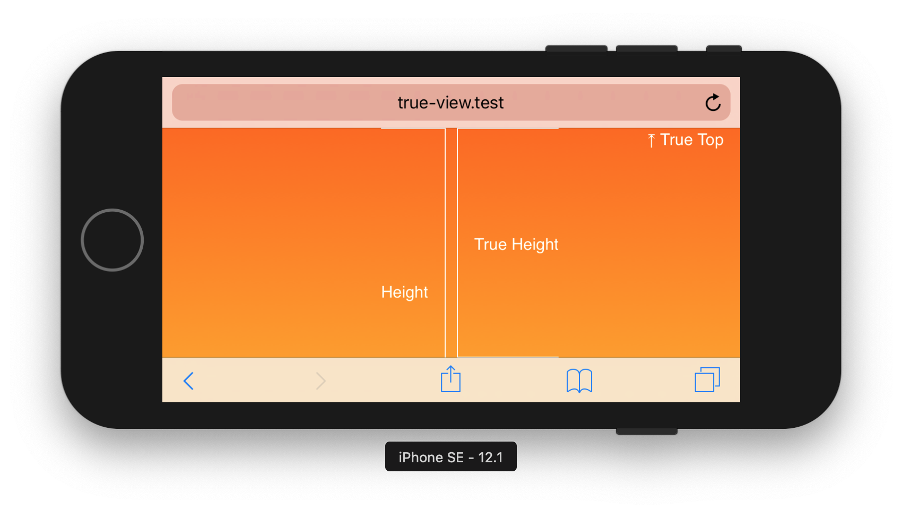

# true-view

Adds `--true-view-height` and `--true-view-top` CSS-variables to the document which represents the actual height and the actual top of the viewport.

## The Problems

### The Wrong height

The height of an element with a height of 100vw on an iPhone is not always what you expect. If you scroll down and up, 100vw represents the height of the viewport plus the top and bottom bar:


Based on https://css-tricks.com/the-trick-to-viewport-units-on-mobile/

### The wrong top

The top of the viewport (`top: 0`) is not always the top of the viewport. If you put your iPhone SE into landscape mode, scroll down and tapp the bottom of the page, `top: 0` has a negative offset with the height of the address bar:


## How to use

In your html:
```html
<script src="true-view.js"></script>
```

In your CSS
```css
#thing {
  height: 100vh; /* fallback */
  height: var(--true-view-height);

  top: 0; /* fallback */
  top: var(--true-view-top)
}
```